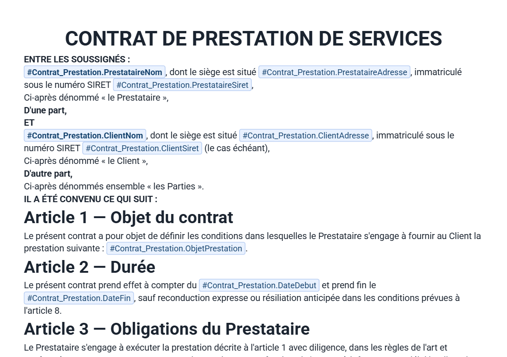

# Publipostage Grist

*🇬🇧 An English version of this document is available [at the bottom of this page](#publipostage-for-grist).*

Il s'agit d'un éditeur de texte avec publipostage et puces intelligentes. Il permet à n'importe qui de
rédiger des contrats, factures ou étiquettes sans écrire la moindre ligne de code, tout en pouvant
référencer une variable de n'importe quelle table du document et la reformater à l'affichage si
nécessaire !

## Aperçu

| Mode édition | Mode lecture |
|---|---|
|  |  |

## Sommaire

- [Fonctionnalités](#fonctionnalités)
- [Installation dans Grist](#installation-dans-grist)
- [Configuration](#configuration)
- [Sécurité et permissions](#sécurité-et-permissions)
- [Dépendances](#dépendances)
- [Note sur l'IA](#note-sur-lia)
- [Roadmap](#roadmap)
- [Licence](#licence)

Moteur d'édition : [TipTap](https://tiptap.dev/)/ProseMirror. Le widget est une simple page statique
hébergée sur GitHub Pages, sans backend ni étape de build.

## Fonctionnalités

**Mise en page**
- Mise en forme complète : gras, italique, souligné, barré, couleurs, polices et tailles réelles en
  points, alignement, titres, listes à puces
- Tableaux, zones 2 colonnes
- Images, y compris flottantes (habillage de texte, calque devant/derrière)
- En-têtes et pieds de page
- Aperçu « format A4 » fidèle, WYSIWYG (ce que vous voyez est ce que vous obtenez)

**Variables Grist intelligentes**
- Autocomplétion `#Table.Colonne` sur toutes les tables, avec des références personnalisées si
  nécessaire, et un formatage sur mesure des dates et des nombres
- Chips intelligents (date du jour, e-mail de l'utilisateur connecté)

**Export PDF**
- Export en PDF vectorisé
- Export en lot (ZIP) sur toutes les lignes d'une table, en un clic
- Nomenclature de fichier personnalisable avec des variables

**Modèles**
- Gestion multi-modèles, sauvegardés directement dans le document Grist
- Galerie de modèles prêts à l'emploi

**Autres**
- Interface bilingue français/anglais
- Choix de la touche utilisée pour déclencher les variables (`#` par défaut)

## Installation dans Grist

1. Dans une page Grist, ajoutez un widget personnalisé et collez cette URL :
   **`https://grist-factory.github.io/Publipostage-Plus/`**
2. Dans le panneau de configuration du widget, réglez **Select by** sur la table dont les lignes
   serviront de source de données. C'est ce réglage qui permet au widget de suivre la ligne
   sélectionnée : sans lui, le mode lecture n'a pas de ligne à résoudre.
3. Grist demande une autorisation d'accès au chargement du widget (voir
   [Sécurité et permissions](#sécurité-et-permissions) plus bas) : elle est nécessaire au bon
   fonctionnement du widget.

## Configuration

- **Créer ou éditer un modèle** : bouton "Nouveau modèle", ou sélecteur de modèle en haut de
  l'éditeur. Chaque modèle est stocké dans une table Grist interne créée automatiquement (préfixée
  `Publipostage_`), qui n'apparaît pas dans les sélecteurs de table habituels.
- **Variables d'une autre table** : le panneau `#` propose un bouton dédié pour configurer une fois
  pour toutes la correspondance entre deux tables.
- **En-tête et pied de page** : cliquez sur une marge en haut ou en bas de la page pour entrer dans
  l'édition dédiée.
- **Réglages** (icône en haut à droite) : langue de l'interface, touche déclenchant le panneau `#`.
- **Nom du fichier PDF** : champ dédié, qui accepte lui aussi des variables.

## Sécurité et permissions

Le widget demande le niveau d'accès `requiredAccess: 'full'`, c'est-à-dire un accès à l'ensemble du
document Grist et pas seulement à la table à laquelle il est lié. Ce niveau est nécessaire dans
l'architecture actuelle : la résolution de variables vers une autre table, l'autocomplétion sur tout le
document et la gestion des tables internes du widget en ont besoin dès le chargement. L'API des widgets
personnalisés Grist ne propose pas de niveau intermédiaire entre l'accès à une seule table et l'accès
complet.

Cet accès s'applique au widget, pas directement à chaque utilisateur : les Règles d'accès natives de
Grist, configurées sur le document par son propriétaire, continuent de s'appliquer normalement. Un
utilisateur restreint à certaines tables ou colonnes le reste en utilisant le widget. C'est donc au
niveau du document Grist lui-même que doit se faire une éventuelle restriction fine des données, pas
dans la configuration du widget.

Le widget charge deux bibliothèques tierces à l'exécution, depuis `esm.sh` (moteur d'édition
TipTap/ProseMirror) et `cdnjs.cloudflare.com` (génération de PDF). Les fichiers venant de `cdnjs` sont
protégés par une intégrité SRI, qui empêche le navigateur d'exécuter un fichier altéré ; ce n'est
techniquement pas possible pour l'import map `esm.sh`.

Aucune donnée n'est stockée hors de Grist. Les seules informations conservées dans le navigateur
(`localStorage`) sont des préférences d'interface comme la langue, jamais de donnée métier.

Pour signaler une vulnérabilité, merci de ne pas ouvrir d'issue publique et de contacter directement
l'équipe de maintenance de ce dépôt.

## Dépendances

Aucune étape de build : tous les fichiers sont servis tels quels. Les bibliothèques tierces sont
chargées à l'exécution, à des versions toujours figées :

| Bibliothèque | Usage | Origine |
|---|---|---|
| `grist-plugin-api.js` | API du widget Grist (obligatoire) | `docs.getgrist.com` |
| TipTap 3.31.3 + ProseMirror (~20 paquets) + `@floating-ui/dom` | Moteur d'édition riche | `esm.sh` |
| pdfmake 0.2.7 + `vfs_fonts` | Export PDF vectoriel | `cdnjs.cloudflare.com` |
| html2pdf.js 0.10.1 | Export PDF qualité raster | `cdnjs.cloudflare.com` |
| JSZip 3.10.1 | Export en lot (archive zip) | `cdnjs.cloudflare.com` |

## Note sur l'IA

Ce widget a été réalisé avec l'aide de Claude Code, avec le modèle Claude Sonnet 5 en mode Ultra Code.
Le code a été relu par un humain (moi), mais je manque de tokens pour être aussi efficace que Claude.

La version Alpha sera aussi l'occasion de corriger ou refacto certains éléments si nécessaire : le
dépôt est ouvert à la collaboration (cf. ci-après).

## Roadmap

De nombreuses fonctionnalités sont prévues et seront ajoutées progressivement dans les prochaines
semaines. N'hésitez pas à réagir aux issues de ce dépôt, ou à m'écrire sur Tchap, pour m'aider à les
prioriser.

**Édition collaborative**
- Sauvegarde automatique (Beta)
- Co-édition, commentaires et suivi des modifications (Beta)

**Publipostage conditionnel**
- Boucles et conditions pour afficher plusieurs lignes d'une même colonne à partir d'une seule variable
  (Beta)

**Édition augmentée**
- Nouveaux blocs et puces (citations, légendes, bloc de code, bloc de signature) (Beta)
- Filigrane (V1)
- Génération de QR code (V1)
- Fusion conditionnelle de plusieurs modèles, par exemple pour adapter les annexes tout en gardant une
  première page identique (Beta)
- Rechercher / remplacer (Beta)

**Import / Export**
- Export DOCX (Beta)
- Export en Markdown
- Import Markdown, avec une fiabilité totale sur les imports depuis Docs de La Suite (Beta)
- Nouveaux formats de page (paysage, A3 à A6) (V1)
- Export PDF : impression navigateur, impression full HD, PDF compressé (Beta)

**Confort d'utilisation**
- Dossier de gestion des modèles (V1)
- Optimisation du chargement (V1)

**Sécurité**
- Version lecture seule : préparer un modèle sur Docs, puis exporter/importer pour une session en
  lecture seule, avant export (V1)
- Version avec les dépendances embarquées, pour éviter tout appel externe (V1)

## Licence

Ce projet est distribué sous licence [GNU General Public License v3.0](LICENSE) (GPLv3).

Copyright (C) 2026 lombre33

---
---

# Publipostage for Grist

*🇫🇷 Une version française de ce document est disponible [en haut de cette page](#publipostage-grist).*

This is a text editor with mail merge and smart chips. It lets anyone write contracts, invoices or
labels without writing a single line of code, while being able to reference a variable from any table
in the document and reformat it on display if needed!

## Preview

| Editing mode | Reading mode |
|---|---|
|  |  |

## Table of contents

- [Features](#features)
- [Installing in Grist](#installing-in-grist)
- [Configuration](#configuration-1)
- [Security and permissions](#security-and-permissions)
- [Dependencies](#dependencies)
- [A note on AI](#a-note-on-ai)
- [Roadmap](#roadmap-1)
- [License](#license)

Editing engine: [TipTap](https://tiptap.dev/)/ProseMirror. The widget is a plain static page hosted on
GitHub Pages, with no backend and no build step.

## Features

**Layout**
- Full formatting: bold, italic, underline, strikethrough, colors, real point sizes and fonts,
  alignment, headings, bullet lists
- Tables, two-column zones
- Images, including floating ones (text wrap, layered in front of/behind)
- Headers and footers
- Faithful "A4 format" preview, WYSIWYG (what you see is what you get)

**Smart Grist variables**
- `#Table.Column` autocomplete across every table, with custom references when needed, and tailored
  formatting for dates and numbers
- Smart chips (today's date, connected user's email)

**PDF export**
- Vector PDF export
- Batch export (ZIP) on every row of a table, in one click
- Customizable file naming with variables

**Templates**
- Multi-template management, saved directly in the Grist document
- Gallery of ready-to-use templates

**Other**
- Bilingual French/English interface
- Choice of key used to trigger variables (`#` by default)

## Installing in Grist

1. In a Grist page, add a custom widget and paste this URL:
   **`https://grist-factory.github.io/Publipostage-Plus/`**
2. In the widget's configuration panel, set **Select by** to the table whose rows will be the data
   source. This is what lets the widget follow the selected row: without it, reading mode has no row to
   resolve against.
3. Grist will ask for an access permission when the widget loads (see
   [Security and permissions](#security-and-permissions) below): granting it is required for the widget
   to work.

## Configuration

- **Create or edit a template**: the "New template" button, or the template picker at the top of the
  editor. Each template is stored in an internal Grist table created automatically (prefixed
  `Publipostage_`), which doesn't show up in the usual table pickers.
- **Variables from another table**: the `#` panel has a dedicated button to set up the relationship
  between two tables once, for good.
- **Header and footer**: click a margin at the top or bottom of the page to enter dedicated editing.
- **Settings** (icon top right): interface language, and the key that triggers the `#` panel.
- **PDF file name**: its own field, which also accepts variables.

## Security and permissions

The widget requests `requiredAccess: 'full'`, meaning access to the whole Grist document rather than
just the table it's linked to. This is needed by the current architecture: resolving variables from
another table, autocompleting across the whole document, and managing the widget's own internal tables
all need it from the moment the widget loads. Grist's custom widget API doesn't offer a middle ground
between single-table access and full access.

This access applies to the widget, not directly to each user: Grist's native Access Rules, set on the
document by its owner, still apply as normal. A user restricted to certain tables or columns stays
restricted while using the widget. Any fine-grained restriction of the data should therefore happen at
the Grist document level, not in the widget's configuration.

The widget loads two third-party libraries at runtime, from `esm.sh` (the TipTap/ProseMirror editing
engine) and `cdnjs.cloudflare.com` (PDF generation). Files from `cdnjs` are protected by SRI integrity
hashes, which stop the browser from running a tampered file; this isn't technically possible for the
`esm.sh` import map.

No data is ever stored outside of Grist. The only thing kept in the browser (`localStorage`) is
interface preferences such as the language, never any business data.

To report a vulnerability, please don't open a public issue: contact this repository's maintainers
directly instead.

## Dependencies

No build step: every file is served as-is. Third-party libraries are loaded at runtime, always at
pinned versions:

| Library | Purpose | Source |
|---|---|---|
| `grist-plugin-api.js` | Grist widget API (required) | `docs.getgrist.com` |
| TipTap 3.31.3 + ProseMirror (~20 packages) + `@floating-ui/dom` | Rich text editing engine | `esm.sh` |
| pdfmake 0.2.7 + `vfs_fonts` | Vector PDF export | `cdnjs.cloudflare.com` |
| html2pdf.js 0.10.1 | Raster quality PDF export | `cdnjs.cloudflare.com` |
| JSZip 3.10.1 | Batch export (zip archive) | `cdnjs.cloudflare.com` |

## A note on AI

This widget was built with the help of Claude Code, using the Claude Sonnet 5 model in Ultra Code mode.
The code was reviewed by a human (me), but I don't have enough tokens to be as thorough as Claude.

The Alpha release will also be a chance to fix or refactor certain parts if needed: this repository is
open to collaboration (see below).

## Roadmap

Plenty of features are planned and will be rolled out gradually over the coming weeks. Feel free to
react to this repository's issues, or write to me on Tchap, to help me prioritize them.

**Collaborative editing**
- Autosave (Beta)
- Co-editing, comments and track changes (Beta)

**Conditional mail merge**
- Loops and conditions to display several rows of the same column from a single variable (Beta)

**Enhanced editing**
- New blocks and bullets (quotes, captions, code blocks, signature blocks) (Beta)
- Watermark (V1)
- QR code generation (V1)
- Conditional merging of several templates, for example adapting appendices while keeping an identical
  first page (Beta)
- Find / replace (Beta)

**Import / export**
- DOCX export (Beta)
- Markdown export
- Markdown import, with full reliability on imports from La Suite Docs (Beta)
- New page formats (landscape, A3 to A6) (V1)
- PDF export: browser print, full HD print, compressed PDF (Beta)

**Quality of life**
- Template management folder (V1)
- Loading time optimization (V1)

**Security**
- Read-only version: prepare a template in Docs, then export/import for a read-only session, before
  exporting (V1)
- Version with bundled dependencies, to avoid any external calls (V1)

## License

This project is distributed under the [GNU General Public License v3.0](LICENSE) (GPLv3).

Copyright (C) 2026 lombre33
